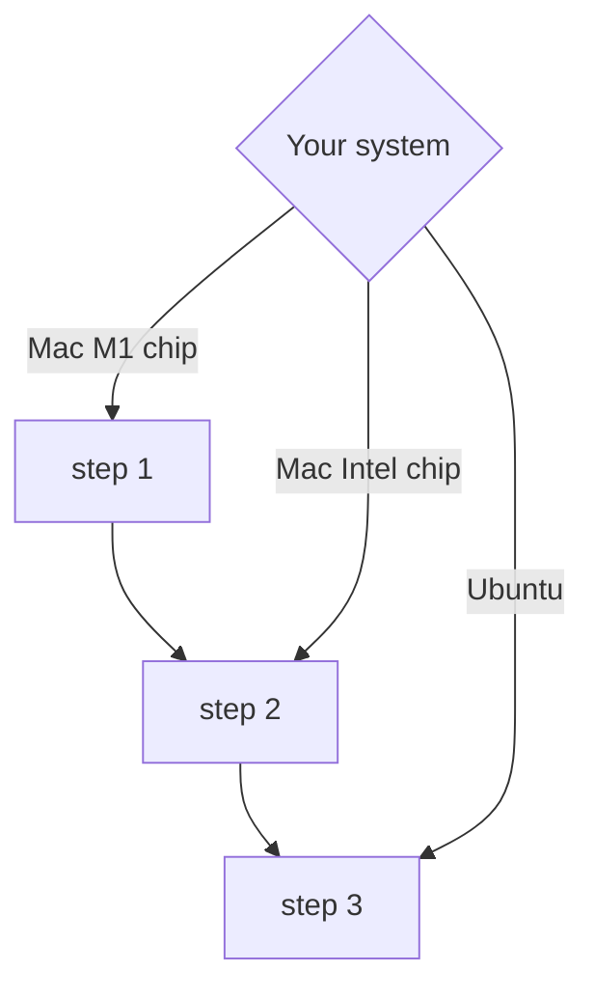
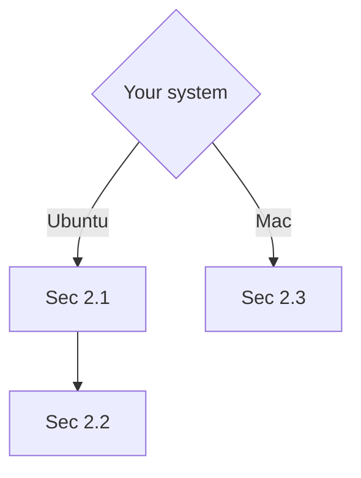

# astro_xray

### UPDATE: For data analysis and the presentation!

**1. Plese refer to the updated guide (the PDF) if you have trouble with the eSASS tasks.**

**2. An example for the presentation is attached to the guide. Use it as a reference, be creative and add your own thoughts!**

**3. Requirements: You should introduce some basic information of your targets, display its eROSITA image and show the spectra and fitting results in the report. Introduce some related works (if it has) and discuss your results would be better.**

### Software Installation 
#### 1. Install HEASoft
**1.1 Downolad HEASoft source code suitbale for your system (e.g. macOS, Ubuntu, etc) at:**
[https://heasarc.gsfc.nasa.gov/docs/software/lheasoft/download.html](https://heasarc.gsfc.nasa.gov/docs/software/lheasoft/download.html)

<ins>Do not choose the Pre-Compiled Binary type!</ins>

<ins>Choose "All" in STEP2 and click 'Submit' only once. </ins>

<ins>Ensure you have enough memory (> 10 GB) to download and install heasoft successfully!</ins>

**1.2 Install the prerequisite packages**

(1) Install rosetta (Required only for M1 users!)

    sudo softwareupdate --install-rosetta

(2) Install homebrew (For Mac users)

    /bin/zsh -c "$(curl -fsSL https://gitee.com/ineo6/homebrew-install/raw/master/install.sh)"

or for M1 users:

    arch -x86_64 /bin/zsh -c "$(curl -fsSL https://gitee.com/ineo6/homebrew-install/raw/master/install.sh)"
    
(3) Install prerequisite packages for heasoft

For Mac users (Intel chip):

    brew install gcc
    brew install perl
For Mac users (M1 chip):

    arch -x86_64 /usr/local/bin/brew install gcc
    arch -x86_64 /usr/local/bin/brew install perl

For Ubuntu users:

    sudo apt-get -y install libreadline-dev
    sudo apt-get -y install libncurses5-dev
    sudo apt-get -y install ncurses-dev
    sudo apt-get -y install curl
    sudo apt-get -y install libcurl4
    sudo apt-get -y install libcurl4-gnutls-dev
    sudo apt-get -y install xorg-dev
    sudo apt-get -y install make
    sudo apt-get -y install gcc g++ gfortran
    sudo apt-get -y install perl-modules
    sudo apt-get -y install python3-dev [or python-dev]
    sudo apt-get -y install python3-pip
    sudo apt-get -y install python3-setuptools
    sudo apt-get -y install numpy
    sudo apt-get -y install python3-astropy
    sudo apt-get -y install python3-scipy

**1.3 Install the software**
(1) Unpack the downloaded file in a clean directory (your home directory is highly recommended)

    cd /usr/local/  # or any other directory you prefer
    sudo tar zxvf /path/to/the/downloaded/file/heasoft-6.31src.tar.gz # change according to your path and filename 

(2) Build the environment --

Set the relevant environment variables to point to the compatible compiler. It is recommended to simply add the following commands in your profile (.zshrc, .bashrc or .cshrc file, normally in your home directory). 

For users of Bourne Shell (sh, zsh and bash):

    export CC=/usr/local/bin/gcc-11
    export CXX=/usr/local/bin/g++-11
    export FC=/usr/local/bin/gfortran-11
    export PERL=/usr/local/bin/perl
    
For users of C Shell variants (csh, tcsh):

    setenv CC /usr/local/bin/gcc-11
    setenv CXX /usr/local/bin/g++-11
    setenv FC /usr/local/bin/gfortran-11
    setenv PERL /usr/local/bin/perl 
    
(3) Go to the heasoft-6.31/BUILD_DIR directory and configure the software for your platform.

For users of Bourne Shell (sh, zsh and bash):

    cd heasoft-6.31/BUILD_DIR/
    ./configure > config.txt 2>&1             
    make > build.log 2>&1                     
    make install > install.log 2>&1   

For users of C Shell variants (csh, tcsh):

    cd heasoft-6.31.1/BUILD_DIR/
    ./configure >& config.txt
    make >& build.log
    make install >& install.log
    
This step will capture the screen outputs to text files, and if you want to see the outputs instantaneously, just ./configure, make and make install.

<ins> At the configure step -- only if you see "Finished" at the end of the output, it means the configuration is successful. If errors occur, be patient to solve them step by step. </ins>

<ins> The make step may take a long time (~ 1 hour). If your process finished in a few minutes, check if there are any errors. </ins>

**1.4 Initialization**

Add the following commands in your profile --

For users of Bourne Shell (sh, zsh and bash):

    export HEADAS=/path/to/your/installed/heasoft-6.31.1/(PLATFORM)
    alias heainit=". $HEADAS/headas-init.sh"
    
For users of C Shell variants (csh, tcsh):

    setenv HEADAS /path/to/your/installed/heasoft-6.31.1/(PLATFORM)
    source $HEADAS/headas-init.csh

where (PLATFORM) is a placeholder for the platform-specific string denoting your machine's architecture, for example:

x86_64-pc-linux-gnu-libc2.31

<ins>You can always find your PLATFORM in the heasoft-6.31/ directory (i.e. the name of a sub-directory)</ins>

Once you finish this step, open a new terminal and try:

    heainit
    xspec
    
If you enter the Xspec environment without any error, the initialization is done! Now you can have a break and dive into the X-ray data analysis!

For more details about the HEASoft installation, it is highly recommend to refer to the instructions in STEP 3 at:
[https://heasarc.gsfc.nasa.gov/docs/software/lheasoft/download.html](https://heasarc.gsfc.nasa.gov/docs/software/lheasoft/download.html)

or:

[https://heasarc.gsfc.nasa.gov/docs/software/lheasoft/install.html](https://heasarc.gsfc.nasa.gov/docs/software/lheasoft/install.html)

You can always find some useful information in these official guide.

And a GitHub website may be helpful for Mac M1 users:

[https://github.com/Leilei-astro/HEASOFTscience/blob/main/Mac%20M1%20install%20heasoft](https://github.com/Leilei-astro/HEASOFTscience/blob/main/Mac%20M1%20install%20heasoft)

#### 2. Install eSASS

For reference, see:
[https://erosita.mpe.mpg.de/edr/DataAnalysis/esassinstall.html](https://erosita.mpe.mpg.de/edr/DataAnalysis/esassinstall.html)

**2.1 Download eSASS and CALDB**

(1) download the script eSASS4EDRmirror.sh at:
[ https://erosita.mpe.mpg.de/eSASS4EDR-download/ ]( https://erosita.mpe.mpg.de/eSASS4EDR-download/ )

Move this script to a clean directory (e.g. create a new sub-directory named as "esass" in your home directory) and make the script executable by typing:

    chmod +x eSASS4EDRmirror.sh

(2) download the package and database files

You can go to <your eSASS path> and download the eSASS package (~200 MB) and CALDB (~ 2.0 GB) by executing the following: 

    cd /<your eSASS path>
    ./eSASS4EDRmirror.sh eSASS
    ./eSASS4EDRmirror.sh CALDB

When it's done, check if you have this directory structure on your disk:

     /<my eSASS path>/caldb
     /<my eSASS path>/demo
     /<my eSASS path>/sw_edr
     /<my eSASS path>/external
     /<my eSASS path>/unpack_edr.sh 

**2.2 Installing eSASS on Ubuntu**

(1) create the eSASS directory structure -- go to <your eSASS path> and typing:

    ./unpack_edr.sh eSASS4EDR sw_edr

(2) build eSASS on x86_64 Linux

    cd /<your eSASS path>/external/Healpix_3.50 
    ./configure
And type as:

    Enter your choice (configuration of packages can be done in any order): 3
    enter name of your F90 compiler (): gfortran
    ...
    enter name of your C compiler (gcc): gcc
    ... 
    enter full name of cfitsio library (libcfitsio.a): libcfitsio.a
    enter location of cfitsio library (/usr/local/lib): /home/helin/heasoft-6.31.1/heacore/x86_64-pc-linux-gnu-libc2.31/lib 
    ...
    Do you want to use :
    (0) the standard serial implementation?
    (1) the parallel implementation 
    Enter choice (1): 0                        
    ... 
    Do you want to:
    (0): exit
    (1): configure Healpix IDL package
    (2): configure Healpix C package, and edit Makefile
    (3): configure Healpix F90 package, and edit Makefile
    (4): configure Healpix C++ package, and edit Makefile
    (5): configure Healpix Python (healpy) package, and edit Makefile
    (8): see what configuration files have been created so far
    (9): edit your shell configuration file to have easier access to Healpix codes
    (-1): reset
         (will *REMOVE* the Makefile and configuration files, and exit)
    (0): exit

    Enter your choice (configuration of packages can be done in any order): 0

***NOTE!***   
<ins>***1. Press enter to accept all default flags.*** </ins>  
<ins>***2. Type y (yes) for all optional settings.*** </ins>    
<ins>***3. The full name and the location of your cfitsio library can be find using the command "locate libcfitsio.a" (the libcfitsio.a file is placed in ~/lib/ directory).*** </ins>

When the configure step is done, you will see a "Good Bye". Then you should run the command:

    make

Then go to the autoconf directory and run configure:

    cd /<your eSASS path>/eSASS4EDR/autoconf  
    ./configure --with-healpix=/<your eSASS path>/external/Healpix_3.50 --with-headas=$HEADAS

There may be errors like "No ** library found!", which means you are missing some required packages. You can easily solve this problem by installing the missing libraries (more and more packages you install > ~ <):

First, search the library with the name of "xxx" (e.g. readline):

    apt-cache search readline # change as you need

There may be a lot of outputs, choose the one named like lib*-dev (e.g. lib64readline-dev) and install it in your home directory:

    sudo apt-get -y install lib64readline-dev

If no more errors occur when configuring, continue to run make:

    make
    make install

Hopefully, you will see "Congratulations! The installation succeeded" after tens of minutes~

Finally, run make clean to remove those unnecessary files and enable the eSASS environment:

    source /<your eSASS path>/eSASS4EDR/bin/esass-init.sh 

<u>It is recommended to add this line to your profile (.bashrc, zshrc or cshrc) for automatic initialisation.</u>

**2.3 Install Docker (for Mac users)**

Users with macOS can use Docker to run eSASS on their computers and do not have to download the eSASS itself. See:
[https://docs.docker.com/desktop/install/mac-install/](https://docs.docker.com/desktop/install/mac-install/)

<ins>Note that you should check your macOS version and make sure you have at least 4 GB of RAM.</ins>

(1) Get Docker on your system

* Download the .dmg file suitable for your system (i.e. Mac with Intel chip or Mac with M1 chip), then drag the Docker icon to the Applications folder.
* Double-click Docker.app in the Applications folder to start Docker.
* Select Accept to continue. Docker Desktop starts after you accept the terms.

<u>You may need to register an account to use docker afterwards.</u>

(2) Launch Docker to use eSASS

* Every time you want to start an eSASS container, do not forget to click and open the docker application on your desktop.
* Open a terminal, and execute:

        docker run --volume /path/to/your/data:/home/idies/workspace/data -ti --rm erosita/esass:latest /bin/bash

<ins>The command ***docker run -it --rm erosita/esass:latest /bin/bash*** will start a container running the full esass image, which is required if you have not downloaded the eROSITA CALDB. </ins>

<ins>The description ***--volume*** makes host machine directories accessible inside the container.</ins>

<ins>The command ***/path/to/your/data:/home/idies/workspace/data***  points eSASS data workpath to your local directory (directory you store the eROSITA data and the eSASS outputs).</ins>

* Then you can use the eSASS tasks in the container!

For reference:
[https://erosita.mpe.mpg.de/edr/DataAnalysis/esassinstall.html](https://erosita.mpe.mpg.de/edr/DataAnalysis/esassinstall.html) (Section 3)

* * *

<ins>If you have more questions about the installation, please feel free to contact me.</ins>

My email: helin@smail.nju.edu.cn

or find me in Wechat group.

#### 完结！撒花！o(≧v≦)o
